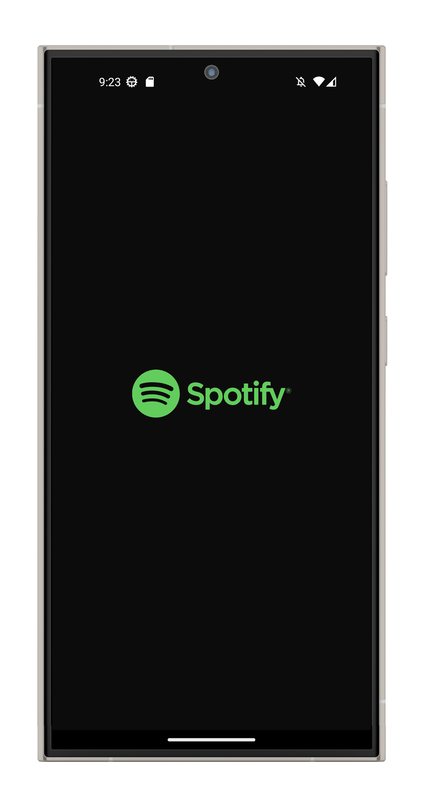
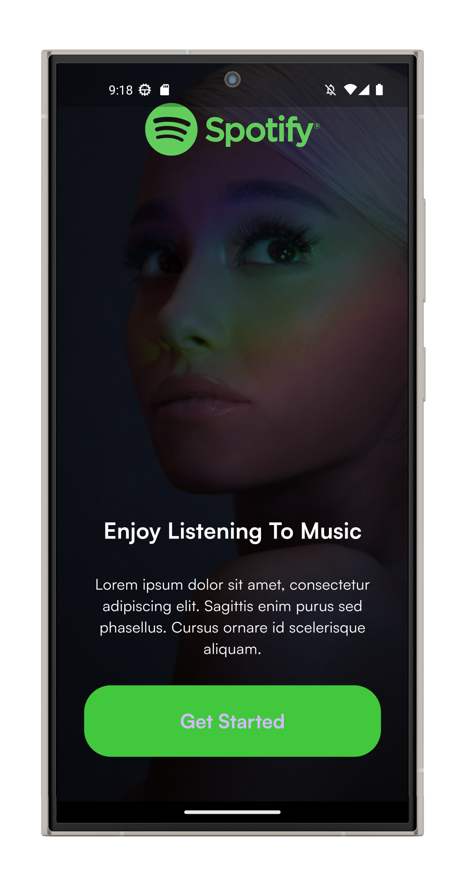
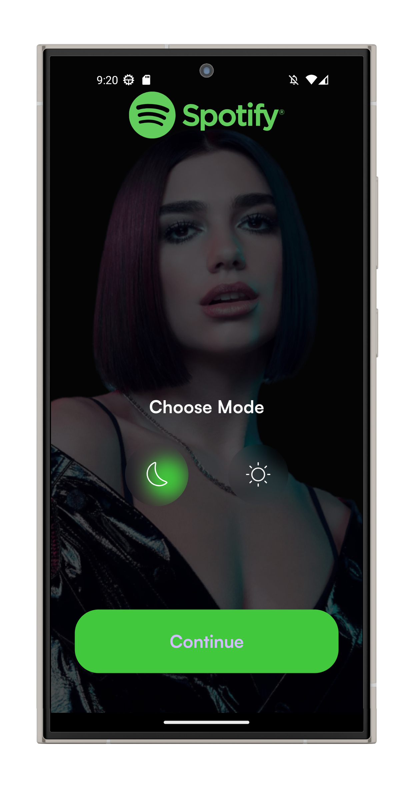
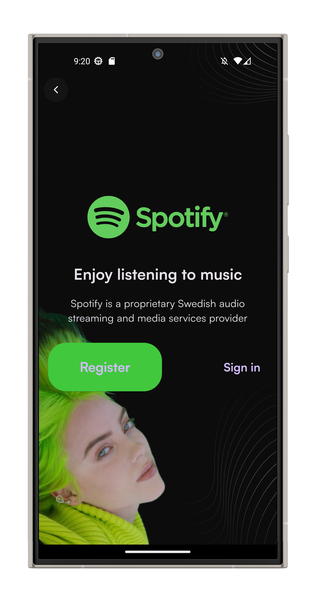
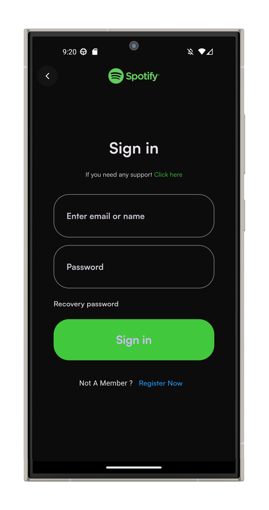
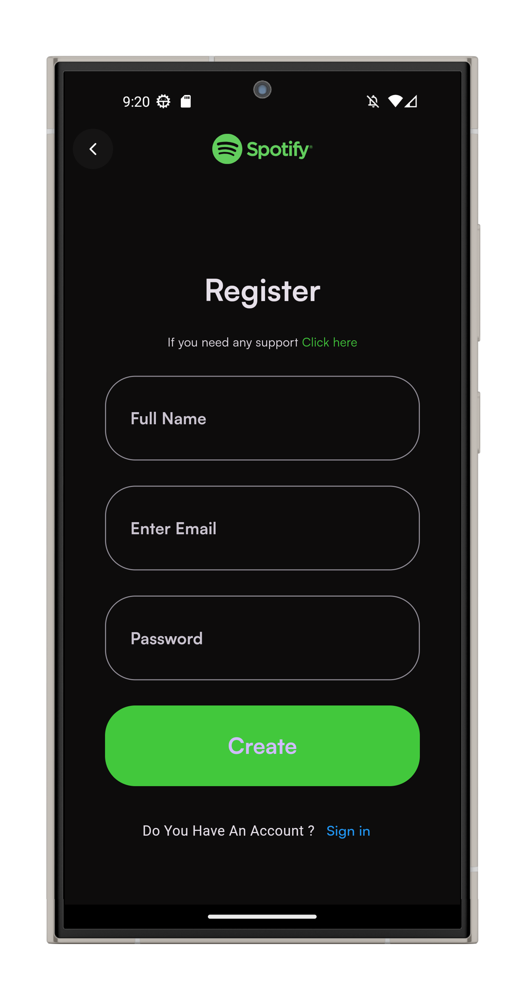
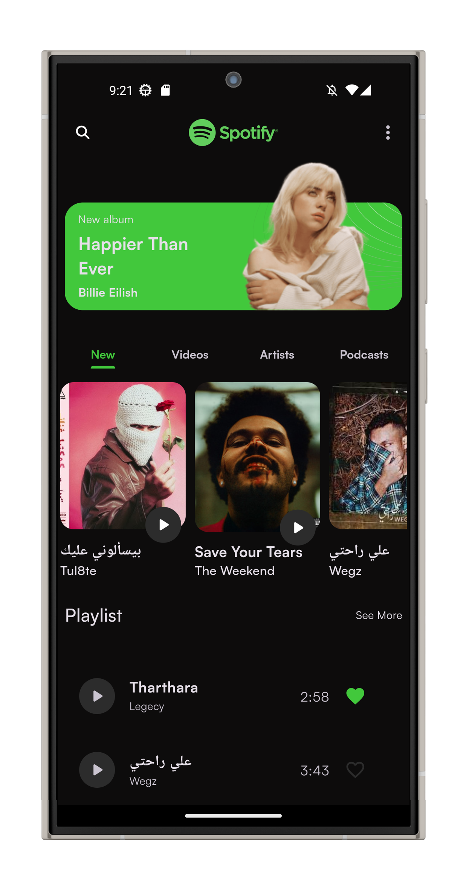
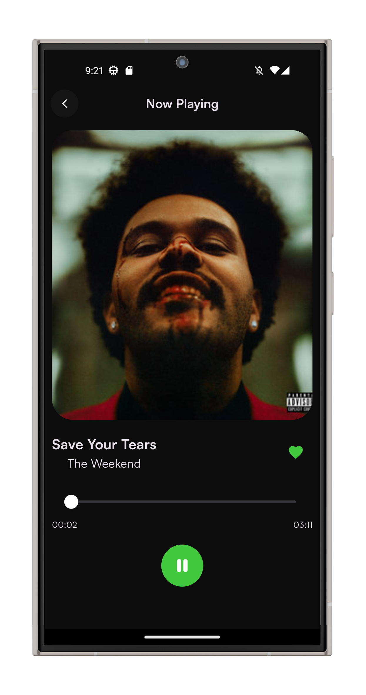

# Spotify Clone 🎵🎧

A Spotify clone built with Flutter, leveraging PocketBase as the backend. This app allows users to explore, manage, and play songs with seamless state management, persistent session storage, and theme mode switching.

---


---

## ✨ Features

- 🎧 **Music Streaming** powered by `just_audio`.
- 🔄 **State Management** using `flutter_bloc` for reactive UI updates.
- 🌗 **Light/Dark Mode** persistence with `hydrated_bloc`.
- 🔐 **Local Storage** using `Hive` to save user session and data.
- 🖥️ **Backend** powered by PocketBase (local server).
  
---

## ⚙️ Getting Started

### Prerequisites

Before starting, make sure you have the following installed:

- [Flutter SDK](https://flutter.dev/docs/get-started/install) (version 3.26.0 or above)
- [PocketBase](https://pocketbase.io/docs/) (local backend server)
- Git

---

### Installation

1. **Clone the repository**:

    ```bash
    git clone https://github.com/yourusername/spotify-clone.git
    cd spotify-clone
    ```

2. **Install Flutter dependencies**:

    ```bash
    flutter pub get
    ```

3. **Set up PocketBase**:

    - Download and install [PocketBase](https://pocketbase.io/docs/).
    
    - Start the PocketBase server on your local machine:

      ```bash
      ./pocketbase serve
      ```

    - **Import the PocketBase schema**:
    
      In the PocketBase admin dashboard (accessible via `http://localhost:8090/_/`), import the schema from the `spotiffy_clone_schema.json` file included in this repository:
    
      1. Go to **Settings** > **Import Collections**.
      2. Upload the `spotiffy_clone_schema.json` file.

4. **Add sample songs to PocketBase**:

    - After importing the schema, go to the **Songs** collection in the admin dashboard.
    - Add a few random songs with the necessary fields (title, artist, album, etc.).

---

## 🚀 Running the App

1. **Run the Flutter app on your device**:

    ```bash
    flutter run
    ```

    Make sure your PocketBase server is running and accessible at `http://localhost:8090`.

2. **Configure the PocketBase URL**:

    Modify the PocketBase server URL in the Flutter app's configuration file (e.g., `lib/config.dart`) to match your local server or any remote server.

---

## 📱 Screenshots










---

## 🤝 Contributing

Contributions, issues, and feature requests are welcome! Feel free to check out the [issues page](https://github.com/andrrew24/spotify-clone/issues).

---

## 📜 License

This project is licensed under the MIT License - see the [LICENSE](LICENSE) file for details.

